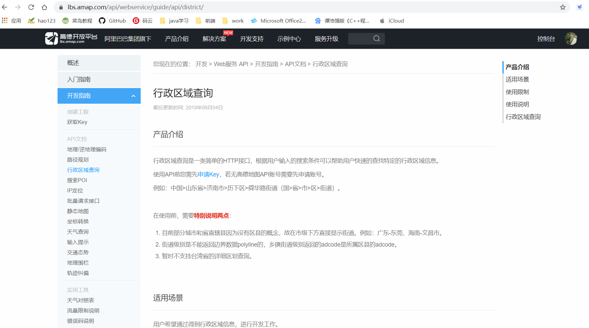

# 首先在高德开放平台中申请自己的账号
### <a href="https://lbs.amap.com/">地址</a> 在该地址中登录自己的账号
详细可以查看文档

### 主要目录解释
+ com.example.quartzcity            同步父级
+ com.example.quartzcity.job        存放定时任务
+ com.example.quartzcity.configs    定时任务的配置位置

